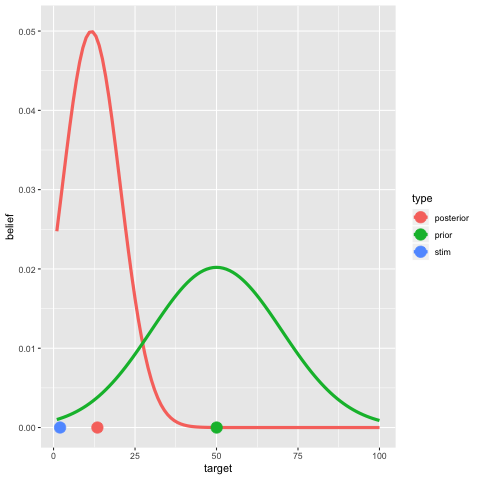
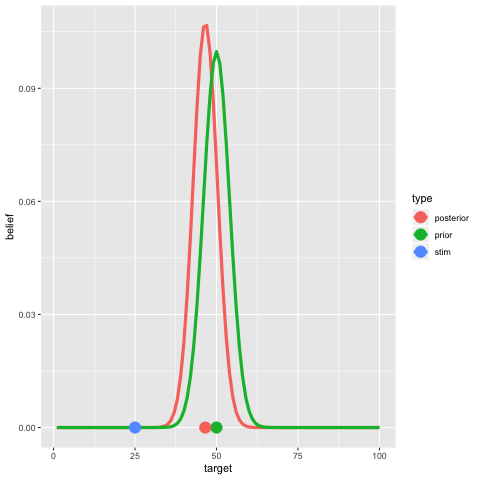

```{r setup, include=FALSE}
knitr::opts_chunk$set(echo = TRUE)
```

For the coding exercise this week, let's consider the Bayesian account of the "perceptual magnet effect" proposed by Naomi Feldman, Tom Griffiths and

- Feldman, N. H., Griffiths, T. L., & Morgan, J. L. (2009). [The influence of categories on perception: Explaining the perceptual magnet effect as optimal statistical inference](./naomiperceptualmagnetlong.pdf). *Psychological Review*, 116(4), 752.

The full paper is definitely worth a read, and it covers a *lot* more than this tutorial. Our goal here isn't really to implement everything from the paper. Instead we're just going to do look at the simplest case and see how the model behaves.

## Single category perceptual magnet

### Theoretical perspective

The simplest case is this. Suppose you hear a speech sound that produces sensory data $s$, and you are trying to determine the true target $t$ sound  that produced the sensory data. Because the world (and the sensory system) is noisy, the actual data $s$ won't be a perfect representation of the true sound $t$: instead it will be some corrupted version of it. The sensory signal $s$ provides a *bottom-up* cue as to the identity of the true sound $t$. 

However, because this is a *speech* sound, you can also rely on top-down knowledge.  Your native langauge might provide some phonetic category $c$ corresponding to a distribution over actually-produced speech signals (i.e. people don't produce random speech sounds, we tend to produce them in a way that mirrors the structure of our language!). What this means is that the listener's knowledge of what kinds of phonetic categories exist in the language provide a top down constraint.

We formalise it like this. The top-down knowledge takes the form of a prior distribution that specifies $P(t|c)$, the probability that the speaker would have generated the true sound $t$ if they were trying to use the phonetic category $c$. The bottom-up knowledge is embodied by the likelihood $P(s|t)$, the probability that the signal $s$ would have been detected by the sensory system if the true sound were $t$.

From this perspective then, *perception* is a process that synthesises sensory data (bottom up information) with conceptual knowledge (top down constraints). The Feldman et al paper proposes thar this synthesis takes place by Bayesian learning. The posterior probability $P(t|s,c)$ that the true sound was $t$ given that the learner has sensory information $s$ and knows that the stimulus belongs to category $c$ is:

$$
P(t|s,c) \propto P(s|t) P(t|c)
$$

In the paper Feldman et al propose that the perceptual category $c$ corresponds to a normal distribution over stimuli $t$ -- i.e. it's a prototype model with category prototype $\mu_c$ and variability $\sigma_c$ -- and that the noise in the world is also normal, so the sensory data $s$ is equal to the $t$ plus some normally distributed noise withe mean 0 and standard deviation $\sigma_n$. This model is so simple that you can derive exact mathematical answers for $P(t|s,c)$ but let's do it the lazy way by coding something numerically!


## Prior and likelihood

As usual, I'm going to rely on the tidyvers package, so the first thing to do is this:

```{r packages, message = FALSE, warning=FALSE}
library(tidyverse)
```

For simplicity, we'll have some parameters. We'll assume that the stimuli only vary along a single dimension (obviously too simplistic) and that there are 100 possible locations for the target $t$ along that dimension. We'll also need to specify the properties of the phonetic category (mean and sd), the location of the sensory data $s$, and the noise level:

```{r parameters}
target <- 1:100
category_mean <- 50
category_sd <- 20
stimulus <- 25
noise <- 10
```

Later we can play with these numbers to see what happens. Next, we need to define functions that will produce our prior and likelihoods:

```{r priorslikelihoods}
# prior
get_prior <- function(t, mu, sig) {
  pr <- dnorm(t, mean = mu, sd = sig) # normal distribution
  pr <- pr / sum(pr)                  # make it sum to 1
  return(pr)
}

# likelihood (is *not* a distribution over hypotheses, so doesn't sum to 1)
get_likelihood <- function(s, t, noise) {
  lik <- dnorm(s, mean = t, sd = noise) # normal distribution
  return(lik) 
}
```

Here's what our prior looks like for the parameters we specified above

```{r drawprior}
# calculate the prior
prior <- get_prior(target, category_mean, category_sd) 

# draw a picture
tibble(target, prior) %>%
  ggplot(aes(x = target, y = prior)) + 
  geom_line(lwd = 1.5, colour = "darkgreen")
```

Here's the likelihood:

```{r drawlikelihood}
# calculate the prior
likelihood <- get_likelihood(stimulus, target, noise) 

# draw a picture
tibble(target, likelihood) %>%
  ggplot(aes(x = target, y = likelihood)) + 
  geom_line(lwd = 1.5, colour = "blue")
```


Neither the prior nor the likelihood provide sufficient evidence to uniquely determine the true target, though it is noteworthy that the likelihood provides more information than the prior (compare the width of the two bell curves).

## Posterior

To integrate the two sources of evidence we need to apply Bayes rule to find the posterior. Again, let's write a function that does this. The core operation is always the same. We multiply `prior` times `likelihood` and then normalise it so that the `posterior` sums to 1. I'm a big fan of making this explicit in the code, so let's actually write a `normalise` function that does this for us:

```{r normalise}
normalise <- function(prob) {
  return( prob / sum(prob) )
} 
```

Using this, we obtain this as our model function:

```{r posterior}
get_posterior <- function(stimulus, target, noise, catmean, catsd) {
  
  # priors and likelihoods
  prior <- get_prior(target, catmean, catsd) 
  likelihood <- get_likelihood(stimulus, target, noise)
  
  # posterior
  posterior <- (prior * likelihood) %>% normalise()
  
  # organise everything into a tibble!
  out <- tibble(stimulus, target, prior, posterior, noise, catmean, catsd)
  
  return(out)
}
```

The thing I like about this way of writing things is that Bayesian reasoning always takes the same format when written in R.... `(prior * likelihood) %>% normalise()`

## A digression...

Okay, I want to show the posteriors, priors etc all in the one plot, so to that end I'm going to write a somewhat less pretty plotting function...

```{r fancyplot}
plot_beliefs <- function(belief) {
  
  belief_long <- belief %>% 
    gather(key = "type", value = "belief", prior, posterior)
  
  belief_summaries <- belief %>% 
    summarise(
      prior = sum(prior * target),
      posterior = sum(posterior * target),
      stimulus = mean(stimulus)
    ) %>% 
    gather(key = "type", value = "location", prior, posterior, stimulus)
  
  pic <- belief_long %>% 
    ggplot(aes(x = target, y = belief, colour = type)) + 
    geom_line(lwd = 1.5) + 
    geom_point(
      data = belief_summaries, 
      mapping = aes(x = location, y = 0, colour = type),
      size = 5
      ) + 
    ggtitle(paste("Noise =", belief$noise[1]))
  
  plot(pic)
}
```

## Back to the main tutorial...

Compute the posterior distribution:

```{r}
belief <- get_posterior(
  stimulus, target, noise, category_mean, category_sd
)
```

Now let's have a look:

```{r}
belief
```

And draw the pretty picture:

```{r}
plot_beliefs(belief)
```

In this plot, the blue dot is the sensory stimulus $s$, the red curve shows the posterior belief distribution over $t$ (mean plotted as the red dot) and the green curve shows the prior distribution $t$ (prior mean is the green dot. 

This is the perceptual magnet effect: the perceived sound (red) is dragged away from the actual stimulus (blue) in the direction of the category mean (green). 


## Exercises

Now that you have implemented the model yourself, try playing with it. If you haven't coded it, code for this model is in the [perceptual_magnet.R](./perceptual_magnet.R) file. Specifically, notice that we specified a bunch of parameters at the start:

```{r}
target <- 1:100
category_mean <- 50
category_sd <- 20
stimulus <- 25
noise <- 10
```

It's worth playing with these to see what effect it has on the *size* of the perceptual magnet effect (i.e. how far apart the red and blue dots are)

## More?

Two animated versions. First, move the stimulus:



Second, widen the prior:




